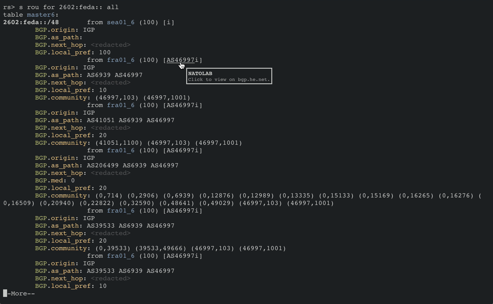

webrs-client
---

This is the client-side (i.e., frontend) of nato internet services' [`webrs`](https://rs.nat.moe). For the server-side, check [webrs-server](https://github.com/nat-lab/webrs-server).



### Configuring

Configurable options are in `src/Configuration.ts`. You will need to host your own [webrs-server](https://github.com/nat-lab/webrs-server) and update the `server` field.

### Building

You will need to have NodeJS ready before you can build the web app. 

```
$ git clone https://github.com/nat-lab/webrs-client
$ cd webrs-client
$ npm i
$ npm install -g typescript webpack
$ webpack --mode production 
```

The bundled app will be located under `public/`.

### License

`webrs-client` itself is distributed under UNLICENSE. Dependencies have their own licenses.